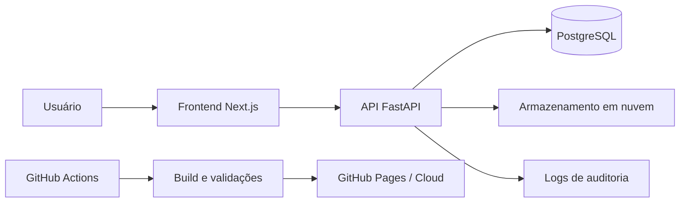

# Arquitetura

O OnBoarding Digital utiliza uma arquitetura web dividida em camadas para manter responsabilidades claras entre interface, regras de negócio, persistência e infraestrutura.

## Visão Geral da Solução

## Camadas

### Frontend

Responsável por entregar a experiência de uso para colaboradores e equipe de RH.

Principais responsabilidades:

- Telas de cadastro e login.
- Formulários de upload de documentos.
- Visualização de status dos documentos.
- Painel de acompanhamento para RH.
- Comunicação com a API.

### Backend

Responsável por centralizar regras de negócio e segurança.

Principais responsabilidades:

- Autenticação e autorização.
- Controle de acesso por perfil.
- Validação de documentos enviados.
- Persistência de metadados.
- Registro de logs de auditoria.
- Exposição de endpoints para o frontend.

### Banco de Dados

O PostgreSQL armazena dados relacionais do sistema.

Entidades esperadas:

- Usuários.
- Perfis de acesso.
- Documentos.
- Status de validação.
- Metadados de upload.
- Eventos de auditoria.

### Infraestrutura

O projeto utiliza Docker e Docker Compose para padronizar o ambiente local e reduzir divergências entre máquinas de desenvolvimento.

### Cloud e Deploy

A Google Cloud Platform é a base prevista para recursos de nuvem, enquanto o GitHub Actions apoia automações de validação e entrega. A documentação é publicada com Markdown e GitHub Pages.

## Princípios Técnicos

- **Segurança por perfil:** colaboradores acessam apenas seus próprios documentos; RH acessa documentos sob sua responsabilidade.
- **Rastreabilidade:** ações relevantes devem gerar registros auditáveis.
- **Separação de responsabilidades:** frontend, backend, banco e infraestrutura evoluem com contratos claros.
- **Reprodutibilidade:** o ambiente deve ser executável via containers.
- **Documentação viva:** decisões e padrões ficam versionados junto ao projeto.

## Histórico de Revisão

| Data | Versão | Autor | Descrição |
|---|---|---|---|
| 24/05/2026 | 1.0 | Raiss Silva de Oliveira | Estrutura Inicial |
| 27/05/2026 | 1.1 | Guilherme Negreiros Pereira | Atualizando arquitetura escolhida para o projeto |
