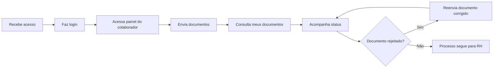
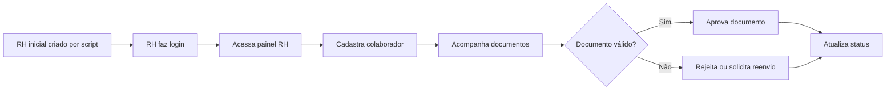
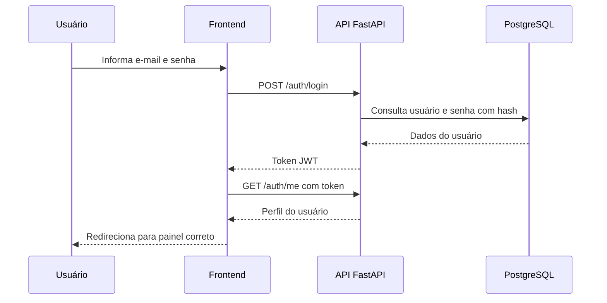

# Jornadas do Usuário

As jornadas descrevem os caminhos esperados para os principais perfis do OnBoarding Digital. Elas servem como referência para validar fluxos de tela, rotas protegidas, permissões e integração entre frontend e backend.

## Jornada do Colaborador

### Etapas

| Etapa | Descrição | Validação Esperada |
|---|---|---|
| Login | Colaborador acessa com e-mail e senha. | Token JWT gerado e perfil identificado. |
| Painel | Sistema direciona para a área de colaborador. | Usuário não RH não acessa área de RH. |
| Upload | Colaborador envia documentos solicitados. | Arquivo e metadados ficam vinculados ao usuário autenticado. |
| Listagem | Colaborador consulta documentos enviados. | Apenas documentos próprios são exibidos. |
| Status | Colaborador acompanha pendências. | Status atualizado aparece na interface. |

## Jornada do RH

### Etapas

| Etapa | Descrição | Validação Esperada |
|---|---|---|
| Criação do primeiro RH | Usuário inicial é criado por script administrativo. | Não existe cadastro público livre de RH. |
| Login RH | RH acessa com credenciais válidas. | Perfil retornado como RH. |
| Cadastro de colaborador | RH cria usuários colaboradores. | Rota protegida por `require_rh`. |
| Acompanhamento | RH consulta documentos enviados. | Dados vêm da API e respeitam permissões. |
| Validação | RH aprova, rejeita ou solicita reenvio. | Status e justificativa ficam persistidos. |

## Jornada Técnica de Autenticação

## Pontos de Atenção

- O fluxo de login deve usar uma rota padronizada no frontend.
- Usuários sem token devem ser redirecionados para a tela de login correta.
- Colaboradores não devem conseguir acessar rotas ou telas de RH.
- O cadastro público não deve permitir criação indevida de colaboradores ou RH.

## Histórico de Revisão

| Data | Versão | Autor | Descrição |
|---|---|---|---|
| 10/06/2026 | 1.0 | Raissa Silva de Oliveira | Criação das jornadas principais |
